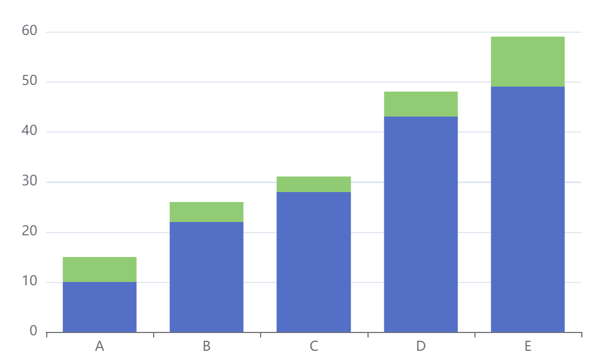

# mdbook-echarts
A preprocessor and cli tool for mdbook to show chart use [Apache Echarts](https://echarts.apache.org/).

#### install

```bash
cargo install mdbook-echarts
```

#### 1. Use as mdbook preprocessor.

```bash
#cat /path/to/your/mdbook/book.toml

[book]
authors = []
language = "en"
multilingual = false
src = "src"

[build]
create-missing = false

#use as mdbook preprocessor
[preprocessor.echarts]

[output.html]
additional-js = ["assets/echarts.min.js"]

[output.html.fold]
enable = true
level = 0

```

### 2. edit your markdown file

- solution 1 no used.

````text

```echarts
option = {
  xAxis: {
    data: ['A', 'B', 'C', 'D', 'E']
  },
  yAxis: {},
  series: [
    {
      data: [10, 22, 28, 43, 49],
      type: 'bar',
      stack: 'x'
    },
    {
      data: [5, 4, 3, 5, 10],
      type: 'bar',
      stack: 'x'
    }
  ]
};
```
````

- solution 2 used.

````text

```echarts
var chartDom = document.getElementById('main');
var myChart = echarts.init(chartDom, null, {
  renderer: 'svg'
});
var option;

option = {
  xAxis: {
    data: ['A', 'B', 'C', 'D', 'E']
  },
  yAxis: {},
  series: [
    {
      data: [10, 22, 28, 43, 49],
      type: 'bar',
      stack: 'x'
    },
    {
      data: [5, 4, 3, 5, 10],
      type: 'bar',
      stack: 'x'
    }
  ]
};
```
````

When you run 
```bash
mdbook serve
```
Or
```bash
mdbook build
```
this will do something to make sure your chart show as you wish.




